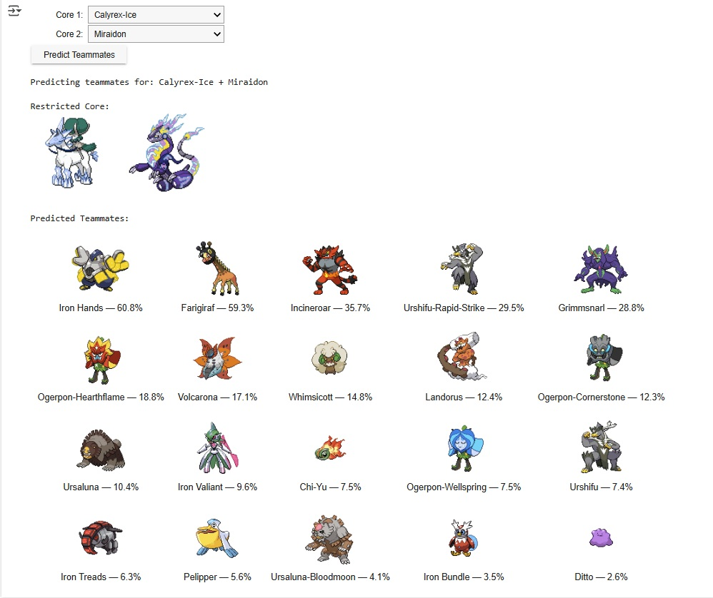

# 🔮 VGC Restricted Core Teammate Predictor

This interactive tool predicts the most likely teammates for a given pair of restricted Pokémon in VGC Regulation I, based on battle data collected from Pokémon Showdown BO3 matches.

It uses a trained supervised machine learning model to identify common patterns and displays the results with sprite images and probabilities in a visual grid.

---

## 🚀 Run in Google Colab

---

## 📁 Files Included

| File                              | Description                             |
|-----------------------------------|-----------------------------------------|
| `vgc_teammate_predictor_demo.ipynb` | The main interactive Colab notebook     |
| `models/vgc_model.joblib`        | Trained multi-output classifier         |
| `data/X_df.csv`                  | Processed input features (core Pokémon) |
| `data/label_columns.json`        | Ordered label list for model compatibility |

---

## 🧠 How It Works

- Choose two restricted Pokémon from dropdown menus  
- Click **Predict Teammates**  
- The top 10 most likely partners will be shown with:  
  - Official sprites via [PokéAPI](https://pokeapi.co/)  
  - Predicted co-occurrence probabilities  
  - Clean grid layout for comparison

---

## 📝 About the Project

This is part of our Milestone II project for the University of Michigan, focused on understanding competitive Pokémon team composition using supervised and unsupervised learning.

More details are available in our [final report](https://docs.google.com/document/d/1rbdwXZoC3--rgzhIU4Iec_lRW2zcIbH-mBzKu1itvjk/edit?usp=sharing).

---

## Interactive WebApp:
Try our [webapp](https://www.seanfontaine.dev/poke-team-predictor) for our supervised learning portion to predict better teams!

---

## ✨ Example Output

---

## 📜 License & Credits

- Pokémon sprites from [PokéAPI](https://pokeapi.co/)  
- Based on VGC Regulation I formats  
- Created by Jackson Montuoro and Sean Fontaine for SIADS 696  

*Generative AI disclaimer: Generative AI was used to assist with formatting this README. All project content and domain-specific logic are original.*
